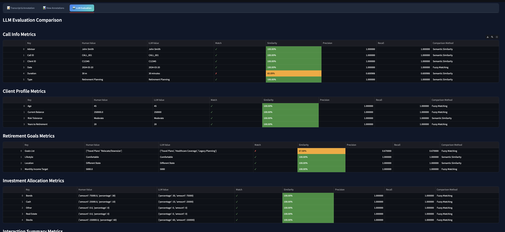

# Call Transcript Annotation Tool

A modern Streamlit application for annotating financial advisory call transcripts with detailed metadata, LLM comparison, and analysis capabilities.

## 🌟 Key Features

### 💬 Call Transcript Display
* Real-time transcript visualization with:
  * Color-coded messages (Agent: Light blue, Customer: Light gray)
  * Timestamp tracking for each message
  * Professional message formatting with consistent black text
  * Split-screen interface for efficient annotation

### 📝 Call Annotation System
* Comprehensive form with expandable sections:
  * 📞 Basic Call Information
    - Call ID, Advisor Name, Duration
    - Date, Client ID, Call Type
  * 👤 Client Profile
    - Age, Risk Tolerance
    - Current 401k Balance
    - Years to Retirement
  * 🎯 Retirement Goals
    - Multiple goal selection
    - Monthly income targets
    - Location preferences
    - Lifestyle expectations
  * 💰 Investment Allocation
    - Percentage and amount tracking
    - Multiple investment types (Stocks, Bonds, Cash, etc.)
    - Real-time portfolio breakdown
  * 📋 Interaction Summary
    - Key topics discussed
    - Advisor recommendations
    - Action items tracking
  * 📅 Follow-up Management
    - Required/Not required
    - Priority levels
    - Follow-up type and date
  * 📌 Additional Notes
    - Special considerations
    - Compliance documentation

### 🤖 LLM Evaluation System
* Side-by-side comparison of:
  * Human annotations
  * LLM-generated annotations
  * Detailed metrics analysis
* Performance Metrics:
  * Precision and recall calculations
  * Section-wise comparison
  * Overall performance metrics
* Visual indicators for matches/mismatches

### 💾 Data Management
* Persistent Storage:
  * Parquet file integration
  * Automatic saving of annotations
  * Data loading capabilities
* Export Options:
  * Download as Parquet
  * Download as CSV
* Real-time data visualization

### 🔍 Evaluation Strategy

#### Comparison Framework
* Side-by-side Analysis:
  * Human annotations (left panel)
  * LLM-generated annotations (middle panel)
  * Metrics visualization (right panel)

#### Metric Calculations
* Field-level Comparison:
  * **Text Fields**
    - Fuzzy string matching using Levenshtein distance
    - Similarity ratio (0-100%) for partial matches
    - Thresholds:
      * >90% = Perfect match (✅)
      * 70-90% = Partial match (⚠️)
      * <70% = No match (❌)
  
  * **List Fields** (e.g., Goals, Topics)
    - Bidirectional fuzzy matching:
      * Human → LLM: Find best match for each human item
      * LLM → Human: Find best match for each LLM item
    - Token-based comparison (order-independent):
      * Uses token_sort_ratio for comparing items
      * "Risk Management" matches "Management of Risk"
    - Partial List Matching:
      * Handles overlapping items (e.g., "Investment Options" present in both lists)
      * Example:
        ```
        Human: ["Investment Options", "Rebalancing Strategy"]
        LLM:   ["Contribution Rates", "Investment Options", "Risk Management"]
        Result: Partial match (⚠️)
          - Found: "Investment Options" (100% match)
          - Precision: ~33% (1 out of 3 LLM items matched)
          - Recall: ~50% (1 out of 2 Human items matched)
          - Similarity: ~42% (average of precision and recall)
        ```
    - Scoring:
      * Precision = Average of LLM→Human best matches
      * Recall = Average of Human→LLM best matches
      * Similarity = (Precision + Recall) / 2
    - Visual indicators: 
      * ✅ Perfect match (precision = recall = 1.0)
      * ⚠️ Partial match
      * ❌ No match

  * **Numeric Fields**
    - Exact value matching
    - Binary scoring (100% or 0%)
    - Future enhancement: tolerance-based matching

#### Performance Metrics
* Section-wise Analysis:
  * Individual metrics for each annotation field
  * Aggregated scores per section
  * Expandable detailed view
  * Similarity percentage display

* Overall Performance:
  * Average Precision across all fields
  * Average Recall across all fields
  * Average Similarity scores
  * Summary statistics dashboard

#### Visual Feedback
* Color-coded Indicators:
  * Green (✅): Perfect match
  * Yellow (⚠️): Partial match
  * Red (❌): No match
  * Gray (❓): Unable to compare
  * Percentage display for similarity scores

#### Use Cases
* Quality Assessment:
  * Evaluate LLM annotation accuracy
  * Identify systematic differences
  * Track performance trends

* Training Feedback:
  * Highlight areas for LLM improvement
  * Identify pattern recognition gaps
  * Guide model fine-tuning

#### Future Enhancements
* Semantic Similarity:
  * Text embedding comparison
  * Fuzzy matching for near-matches
  * Context-aware evaluation

* Advanced Metrics:
  * F1 score calculation
  * Weighted scoring system
  * Custom metric definitions

* Visualization:
  * Trend analysis over time
  * Performance heat maps
  * Interactive metric exploration

## 🚀 Installation & Setup

1. Clone the repository:

## 📸 Screenshots

### Transcript & Annotation Tab

*Main interface with color-coded transcript viewer and comprehensive annotation form*

### View Annotations Tab

*Tabular view of all submitted annotations with export options*

### LLM Evaluation Tab

*Side-by-side comparison of human annotations vs LLM-generated annotations with performance metrics*
